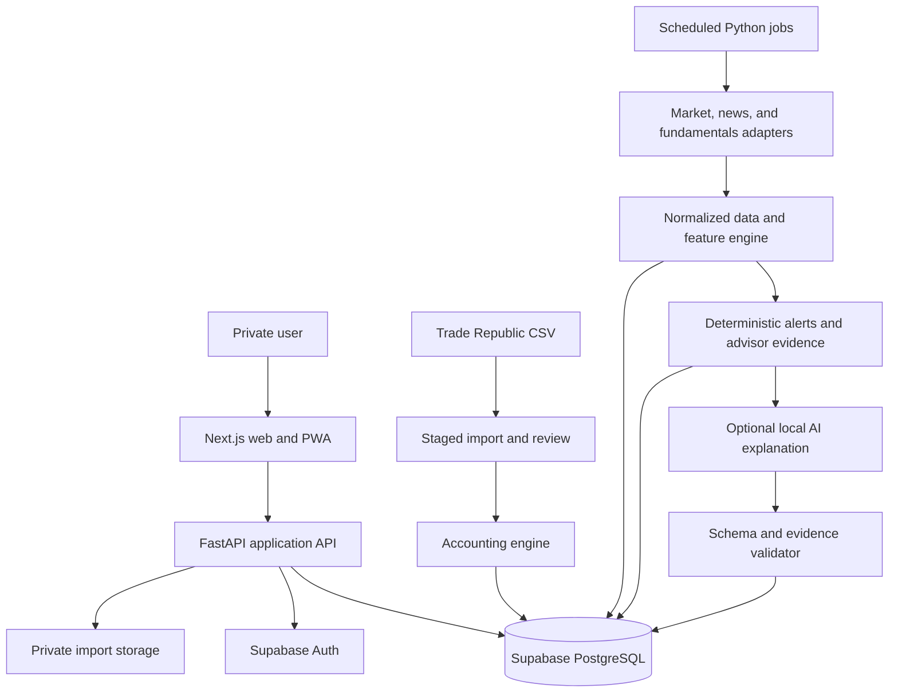

# System overview

## Boundary rules

- The browser never calculates financial totals and never receives server-only credentials.
- Domain calculations are pure Python modules independent of HTTP and provider clients.
- Providers return normalized data through adapters; no UI component calls external market services directly.
- AI receives validated evidence packs and cannot mutate financial facts.
- Every displayed recommendation links to evidence, source, and freshness metadata.
